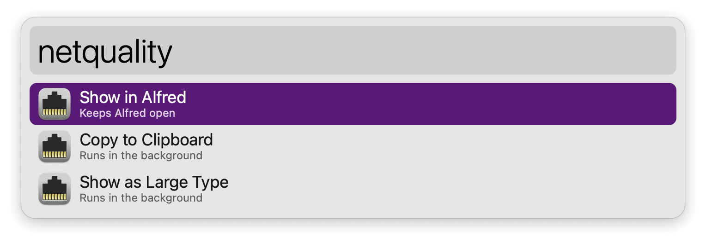
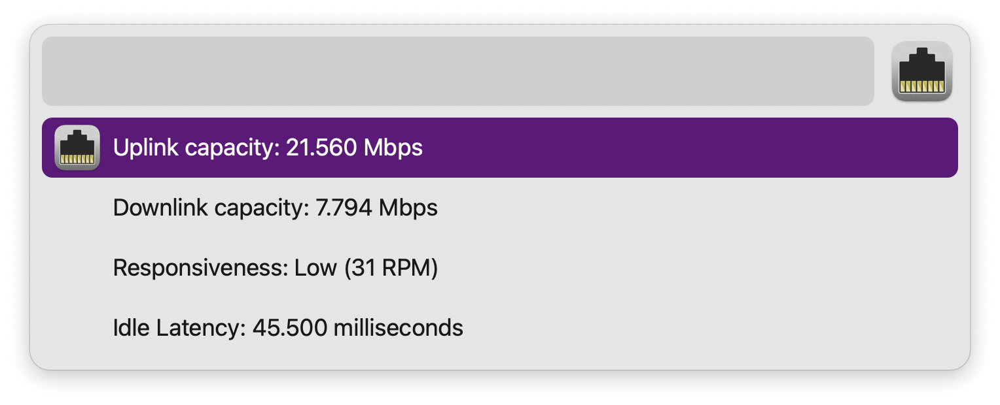

#  Network Quality Alfred Workflow

Test your internet connection

<a href='https://github.com/alfredapp/network-quality-workflow/releases/latest/download/Network.Quality.alfredworkflow'>⤓ Download Workflow</a>

## Usage

Run the Test Keyword (default: `netquality`) to test your internet connection. Analysis takes a few seconds to complete.

