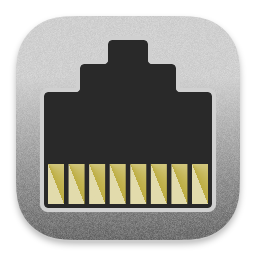

#  Network Quality Alfred Workflow

Test your internet connection

[⤓ Install on the Alfred Gallery](https://alfred.app/workflows/alfredapp/network-quality)

## Usage

Examine your internet connection via the `netquality` keyword.

Analysis takes a few seconds to complete. Results are copied to the clipboard and displayed in the viewer defined in the [Workflow’s Configuration](https://www.alfredapp.com/help/workflows/user-configuration/).

